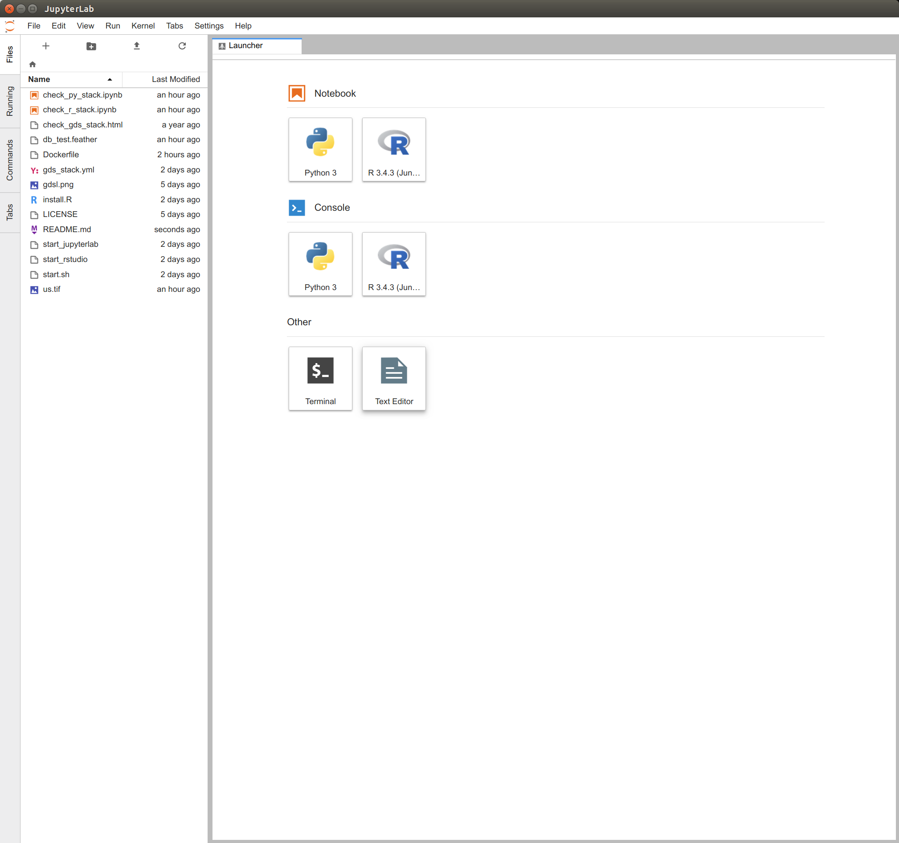

# `gds_env`: A containerised platform for Geographic Data Science

[](https://microbadger.com/images/darribas/gds:4.1 "Get your own image badge on microbadger.com")
[](https://microbadger.com/images/darribas/gds:4.1 "Get your own version badge on microbadger.com")
[](https://zenodo.org/badge/latestdoi/65582539)

* [Dani Arribas-Bel](http://darribas.org)
  [[@darribas](http://twitter.com/darribas)]

This repository contains a `docker` container that includes:

* `[gds_py]`: a full LaTeX distribution.
* `[gds_py]`: a full Python stack ready for geospatial analysis (see [`stack_py.txt`](stack_py.txt) for a detailed list).
* `[gds]`: `gds_py` + a full R stack ready for geospatial analysis (see [`stack_r.txt`](stack_r.txt) for a detailed list).
* `[gds]`: both the [`IRkernel`](https://github.com/IRkernel/IRkernel) and [`rpy2`](https://bitbucket.org/rpy2/rpy2) channels to interact with R through Jupyter.
* `[gds_dev]`: `gds` + additional development utilities (e.g. `pandoc`, `git`, `decktape`, `jekyll`, `jupyter-book`, `bookdown`).

## Requirements

You will need [Docker](https://www.docker.com) to be able to install the GDS environment.

## Installing

You can install this container by simply running:

> `docker pull darribas/gds:4.1`

[Note that you'll need [Docker](https://www.docker.com) installed on your machine]

## Building

If, instead, you want to build from source, the Docker image can be built by running:

> `docker build -t gds .`

You can check it has been built correctly by:

> `docker image ls`

And you should see one image with the name `gds`.

## Running

The container can be run as:

```
> docker run --rm -ti -p 8888:8888 -v ${pwd}:/home/jovyan/host darribas/gds:4.1
```



A couple of notes on the command above:

* This opens the `8888` port of the container, so to access the Lab instance,
  you will have to point your browser to `localhost:8888` and insert the token
  printed on the terminal
* The command also mounts the current folder (`pwd`) to the container, but you can replace that with the path to any folder on your local machine (in fact, that will only work on host machines with the `pwd` command installed)

## Citing

[](https://zenodo.org/badge/latestdoi/65582539)

```bibtex
@software{gds_env,
  author = {{Dani Arribas-Bel}},
  title = {\texttt{gds\_env}: A containerised platform for Geographic Data Science},
  url = {https://github.com/darribas/gds_env},
  version = {4.1},
  date = {2019-08-06},
}
```

---

[](https://www.liverpool.ac.uk/geographic-data-science/)

