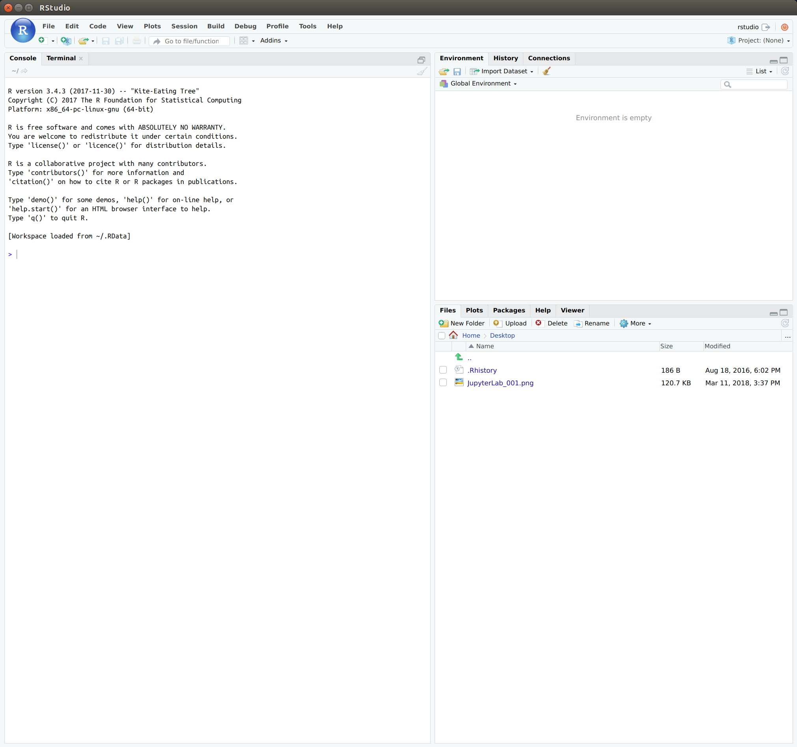

# The GDS stack

* [Dani Arribas-Bel](http://darribas.org)
  [[@darribas](http://twitter.com/darribas)]

This repository contains a `docker` container that includes:

* A full Python stack ready for geospatial analysis (see `gds_stack.yml` for a detailed list).
* A full R stack ready for geospatial analysis (see `install.R` for a detailed list).
* Both the [`IRkernel`](https://github.com/IRkernel/IRkernel) and [`rpy2`](https://bitbucket.org/rpy2/rpy2) channels to interact with R through Python.
* A full LaTeX distribution.
* Additional development utilities (e.g. `pandoc`, `git`, `decktape`, etc.).

It is rather heavy (around 10GB) but it is meant to provide a fully isolated environment that can be deployed in a wide array of contexts and encompass several situations.

## Requirements

You will need [Docker](https://www.docker.com) to be able to install the GDS environment.

## Installing

You can install this container by simply running:

> `docker pull darribas/gds`

[Note that you'll need [Docker](https://www.docker.com) installed on your machine]

## Building

If, instead, you want to build from source, the Docker image can be built by running:

> `docker build -t darribas/gds .`

You can check it has been built correctly by:

> `docker image ls`

And you should see one image with the name `gds`.

## Running

The container can be run as:

```
> docker run --rm -p 8787:8787 -v `pwd`:/home/gdser/host -it darribas/gds
```

A couple of notes on the command above:

* This opens the `8787` port of the container, so if you want to access server-based applications from the container (ie. Jupyter Lab or RStudio), you will need to point your browser to `localhost:8787`
* The command also mounts the current folder (`pwd`) to the container, but you can replace that with the path to any folder on your local machine
* Docker should tell you what your password is for the instance, but may omit the `localhost` part. If you get output from the shell saying `http://73cf3c20de5a:8888/?token=2cbbb3172fe8db0f2558cc68bbae273145cd86cd1fbf206c&token=2cbbb3172fe8db0f2558cc68bbae273145cd86cd1fbf206c`, for example, you will need to navigate to the url `localhost:8888/?token=2cbbb3172fe8db0f2558cc68bbae273145cd86cd1fbf206c&token=2cbbb3172fe8db0f2558cc68bbae273145cd86cd1fbf206c` (see [#8](https://github.com/darribas/gds_env/issues/8)). 

### Jupyter Lab


Once in the container, you can launch Jupyter Lab by runing:

> `start_jupyterlab`

Which is a short for:

> `jupyter lab --port=8787 --no-browser --ip='*' --allow-root`

### RStudio



Once inside the container, you can start RStudio by running:

> `start_rstudio`

Which is also a short for:

> `rstudio-server start`

NOTE: you might have to stop the server (`rstudio-server stop`) afterwards if
you want to launch Jupyter Lab as otherwise it might conflict with the port

---

---


<!--
| OS      | Status |
| ------- | -----------------|
| Linux & macOS   | [](https://travis-ci.org/darribas/gds_env) |
-->

---

[](https://www.liverpool.ac.uk/geographic-data-science/)

